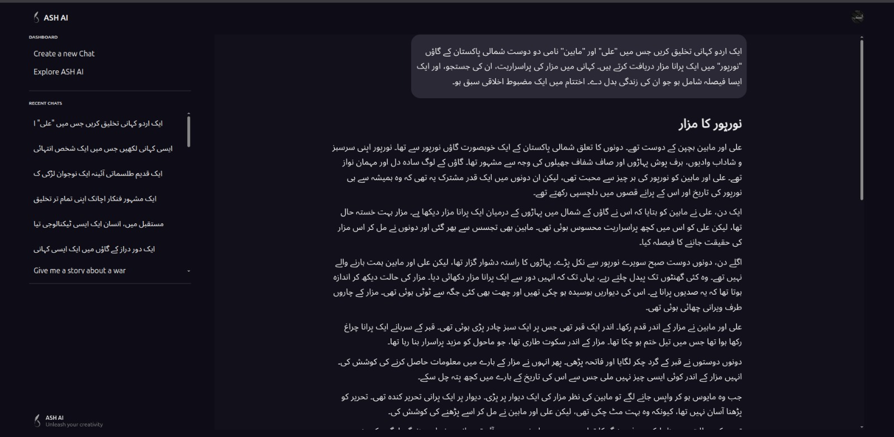

# ASH Urdu Story Generation Suite 🎓📚

This is the official repository for our Final Year Project (FYP): **ASH - Urdu Story Generation Suite**. It is a complete pipeline for generating Urdu stories, converting them into video formats, and providing an interactive educational chatbot focused on Urdu literature and culture.

---

## 🧩 System Modules

### 1. 🌐 Client Interface Module (Frontend)
A responsive React.js web application that allows users to:

- Submit prompts for Urdu story generation using either Finetuned or RAG models.
- View generated Urdu stories.
- Provide input for generating videos based on stories or prompts.
- Monitor the status and progress of video generation.
- Interact with an intelligent chatbot.
- Access generated videos and chatbot responses.

This is where users lands on startup.


Information about each of the model in the suite.


This is where users input prompts to generate stories or videos.


### 2. ✍️ Finetuned Story Generation Module
Generates Urdu stories using a **finetuned LLaMA 3.2 8B** model.

- Accepts user prompt and returns a generated Urdu story.
- Hosted on Colab with ngrok tunneling.
- The ngrok URL must be added to the backend config for story generation.


### 3. 🔎 RAG-based Story Generation Module
Combines semantic retrieval with **Gemini 2.5 Flash experimental** for high-quality Urdu stories.

- Fetches relevant stories from a local database.
- Analyzes writing styles and context.
- Generates a new Urdu story informed by the retrieved content.
- 


### 4. 🎞️ Static Video Generation Module (Colab)
Converts Urdu stories into narrated animated videos.

- Parses stories into scene descriptions using Gemini.
- Generates visuals with **Stable Diffusion XL**.
- Adds narration with **Google Text-to-Speech (Urdu)**.
- Combines everything into a final stitched video.


> **How to Run:**
> - Run the `Static-B.ipynb` notebook (on a Colab T4 GPU). It will display an ngrok URL (port exposed).
> - Copy that ngrok URL into `Static-A.ipynb` and run it.
> - The final ngrok URL from Static-A is then used in the backend.

### 5. 🌀 Fluid Video Generation Module (Colab & Scalable)
Creates dynamic videos from a single prompt, combining narration, visuals, and background music.

- Parses prompt and generates image/music descriptions using Gemini.
- Distributes image generation tasks to multiple Colab "B" workers.
- Each worker runs on a separate Colab T4 instance and exposes a port using ngrok.
- Uses **MusicGen Small** for background music.
- Combines assets into a video with narration.


> **How to Run:**
> - Launch up to N Colab notebooks for `Fluid-B.ipynb` (scalable workers). Each displays its ngrok URL.
> - Copy all worker URLs into `Fluid-A.ipynb` and run it (also on Colab with ngrok).
> - Use the final Fluid-A ngrok URL in the backend for endpoint communication.

### 6. 🤖 Chatbot Module
A bilingual chatbot (Urdu/English) trained to answer questions about Urdu literature and history.

- Maintains session context.
- Performs real-time web search using DuckDuckGo Search API when needed.
- Powered by Gemini for intelligent, contextual answers.

  

---

## 🧠 Tech Stack

| Layer         | Technologies Used |
|---------------|--------------------|
| Frontend      | React.js |
| Backend       | FastAPI |
| AI Models     | LLaMA 3.2 8B, Gemini 2.5 Flash, Stable Diffusion XL, Stable-video-diffusion-img2vid-xt MusicGen |
| TTS           | Google Text-to-Speech (Urdu) |
| Hosting       | Google Colab (T4 GPUs), ngrok |
| Database      | MongoDB |
| Tools         | Git, Python, Colab, LangChain, Ngrok |

---
## 🙌 Team Members

- [Sarmad Siddique](https://github.com/SarmadSiddique03)
- [Ansab Sultan](https://github.com/Ansab-Sultan)
- [Hooria Ajmal](https://github.com/hooriaajmal)


## ⚙️ Setup & Running Tips

```bash
# Clone the repository
git clone https://github.com/sarmad003/ASH-Urdu-Story-Generation-Suite.git
cd ASH-Urdu-Story-Generation-Suite

# Start the backend server
cd backend
uvicorn main:app --reload
